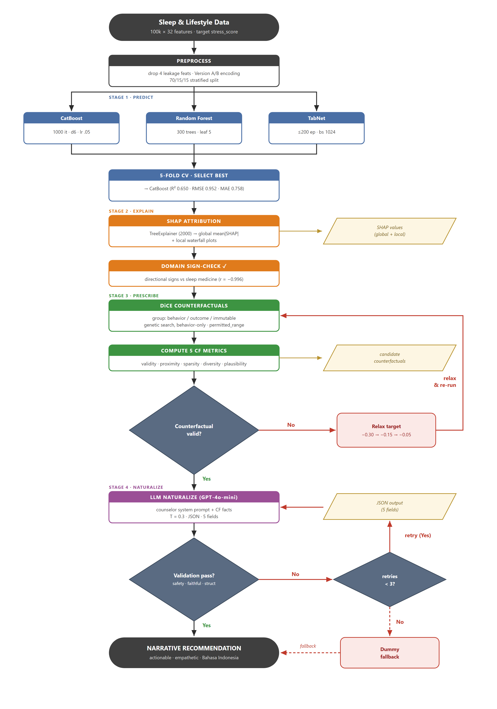

# Penjelasan Flowchart Pipeline — JUTI Paper

**Explainable Machine Learning with Counterfactual Analysis and GenAI Naturalization for Stress Prediction and Intervention Using Sleep and Lifestyle Data**



> Diagram di atas menggambarkan **alur kontrol end-to-end** dari framework empat tahap: **Predict → Explain → Prescribe → Naturalize**, lengkap dengan titik keputusan (decision) dan jalur umpan-balik (loop).

---

## Legenda bentuk & warna

| Elemen | Arti |
|---|---|
| ⬭ **Stadium abu-abu gelap** | Terminator — titik **mulai** (input data) / **selesai** (output narasi) |
| ▭ **Persegi (header berwarna)** | **Proses** / langkah komputasi |
| ◇ **Belah ketupat biru-abu** | **Decision** — titik percabangan (Yes / No) |
| ▱ **Jajar genjang krem** | **Artefak data / I/O** (hasil antara) |
| ▭ **Kotak pink (border merah)** | **Aksi loop** — relax target / dummy fallback |
| → **Panah hitam** | Aliran utama (jalur "Yes") |
| → **Panah emas** | Aliran ke artefak data |
| → **Panah merah** | Jalur **feedback / loop** |
| ┄→ **Panah merah putus-putus** | Jalur **fallback** |

**Warna header proses:** 🔵 biru = Stage 1 (model & 5-fold CV) · ⬛ slate = Stage 2–4 (Explain / Prescribe / Naturalize).

---

## Alur utama (ringkas)

```
Data → Preprocess
     → [CatBoost ‖ Random Forest ‖ TabNet] → 5-fold CV → pilih CatBoost
     → SHAP (global+lokal) → domain sign-check
     → DiCE (behavior-only) → hitung 5 metrik CF
     → ◇ Counterfactual valid? ──No─→ Relax target ↺ kembali ke DiCE
                               └─Yes─→ GPT-4o-mini (naturalisasi)
     → ◇ Validation pass? ──No─→ ◇ retries < 3? ──Yes─→ ↺ ulang GPT
                          │                        └─No──→ Dummy fallback ┄→ output
                          └─Yes────────────────────────────────────────→
     → Narrative Recommendation (Bahasa Indonesia)
```

---

## Detail tiap node

| # | Node | Tahap | Yang terjadi | Parameter / hasil |
|---|------|-------|--------------|-------------------|
| 1 | **Sleep & Lifestyle Data** | input | Dataset mentah | 100k sampel × 32 fitur · target `stress_score` (1–10) |
| 2 | **Preprocess** | — | Bersihkan & siapkan data | Buang 4 fitur *leakage*; Version A (kategorikal mentah → CatBoost) / Version B (ordinal + scaler → RF, TabNet); split 70/15/15 stratified deciles |
| 3 | **Predict (paralel)** | Stage 1 | Latih 3 model | CatBoost (1000 it, depth 6, lr 0.05) · Random Forest (300 trees, leaf 5) · TabNet (≤200 ep, batch 1024) |
| 4 | **5-fold CV · Select best** | Stage 1 | Validasi silang & pilih model terbaik | **CatBoost** terpilih — R² 0.650 · RMSE 0.952 · MAE 0.758 |
| 5 | **Explain (SHAP)** | Stage 2 | Interpretasi model | TreeExplainer (2000 sampel) → global `mean\|SHAP\|` + local waterfall |
| 6 | **Domain sign-check** | Stage 2 | Validasi arah pengaruh fitur vs literatur tidur | korelasi fitur teratas **r = −0.996** ✓ |
| 7 | **Prescribe (DiCE)** | Stage 3 | Cari counterfactual yang actionable | Kelompokkan fitur (behavior / outcome / immutable) → genetic search **behavior-only** dengan `permitted_range` |
| 8 | **Compute 5 CF metrics** | Stage 3 | Evaluasi kualitas counterfactual | validity · proximity · sparsity · diversity · plausibility |
| 9 | **GPT-4o-mini (Naturalize)** | Stage 4 | Ubah CF jadi narasi | counselor system prompt + CF facts · T=0.3 · JSON · 5 field |
| 10 | **Narrative Recommendation** | output | Rekomendasi akhir | actionable · empathetic · **Bahasa Indonesia** untuk pengguna awam |

### Artefak data (I/O)
- **SHAP values** — kontribusi fitur global & lokal (hasil tahap Explain).
- **Candidate counterfactuals** — kandidat skenario perubahan (hasil tahap Prescribe).
- **JSON output (5 field)** — `summary, drivers, recommendations, encouragement, disclaimer` (hasil tahap Naturalize).

---

## Titik keputusan & jalur umpan-balik

1. **◇ Counterfactual valid?** — apakah DiCE menghasilkan counterfactual yang mencapai target penurunan stres?
   - **Tidak** → **Relax target** (longgarkan target bertahap **−0.30 → −0.15 → −0.05**) lalu **ulangi** pencarian DiCE.
   - **Ya** → lanjut ke naturalisasi. *(Hasil: 62.5% valid, plausibility 100%.)*

2. **◇ Validation pass?** — apakah output GPT lolos validasi 3-lapis: **safety** (regex), **faithfulness** (kesetiaan angka/arah), dan **structural** (kelengkapan JSON)?
   - **Ya** → keluarkan narasi final.
   - **Tidak** → cek decision berikutnya ↓

3. **◇ retries < 3?** — apakah jatah percobaan ulang masih ada?
   - **Ya** → **retry** (panggil ulang GPT dengan feedback).
   - **Tidak** → **Dummy fallback** (narasi cadangan aman) ┄→ tetap menghasilkan output.

---

## Catatan

- **Sumber (vektor):** [`outputs/pipeline_flowchart.svg`](outputs/pipeline_flowchart.svg) — versi rapi (editable).
- **Render raster:** [`outputs/pipeline_flowchart.png`](outputs/pipeline_flowchart.png) (2920×4160, 2×).
- Regenerate PNG dari SVG (headless Chrome): `chrome --headless=new --force-device-scale-factor=2 --window-size=1460,2080 --screenshot=outputs/pipeline_flowchart.png outputs/_flowchart_render.html`
- Status: ✅ **sudah diterapkan** sebagai **Fig. 1** di `JUTI.docx` (lebar 6.2", menggantikan diagram layered). Fig. 2/3/4 = model comparison / SHAP / CF metrics.
- ⚠️ `JUTI.pdf` perlu **di-export ulang** dari Word agar versi PDF ikut memuat flowchart ini.
