# Stress Prediction with Explainable ML + Counterfactual + GenAI

Penelitian conference paper: framework 4-tahap untuk prediksi `stress_score` dari data tidur & gaya hidup, dijelaskan dengan SHAP, diberi rekomendasi via counterfactual (DiCE), lalu dinaturalisasi menjadi narasi sistem pakar berbahasa Indonesia via GPT-4o-mini.

**Authors**: Obi Kastanya, Dhayu Intan Nareswari, Ananta Dwi Prayoga Alwy, Mahathir Muhammad
Department of Informatics, Faculty of Intelligent Electrical and Informatics Technology, Institut Teknologi Sepuluh Nopember (ITS), Surabaya.

Detail riset & metodologi di [docs/research_draft.md](docs/research_draft.md).

## Pipeline 4-Tahap

1. **PREDICT** — Regresi `stress_score` (1.0–10.0) pakai CatBoost, Random Forest, TabNet
2. **EXPLAIN** — SHAP global + local + domain validity sign-check
3. **PRESCRIBE** — DiCE counterfactual dengan causal restriction (behavior-only)
4. **NATURALIZE** — GPT-4o-mini dengan 3-layer validation (safety + structural + faithfulness)

<p align="center">
  <br>
  <sub>Alur pipeline 4-tahap (model paralel + titik keputusan & feedback loop) — penjelasan detail di <a href="docs/PIPELINE_FLOWCHART.md">docs/PIPELINE_FLOWCHART.md</a></sub>
</p>

## Hasil Utama (sample 10k)

| Metrik | Value |
|---|---|
| **CatBoost R²** | 0.6503 (best dari 3 model) |
| MAE | 0.7584 |
| 5-Fold CV R² | 0.6266 ± 0.0093 |
| SHAP `sleep_quality_score` corr | −0.996 (domain valid) |
| **CF Success Rate** | 62.5% (25 dari 40 instances) |
| Plausibility | 100% (semua CF di dalam `permitted_range`) |
| Case Studies | 3/3 sukses (low/mid/high) |
| GenAI naturalization | 3/3 lolos safety + structural + faithfulness |

## Visualisasi & Penjelasan Hasil

Semua figur ada di [`outputs/figures/`](outputs/figures/); angka mentah di [`outputs/reports/`](outputs/reports/).

### EDA — Eksplorasi Data (Section 0–2)

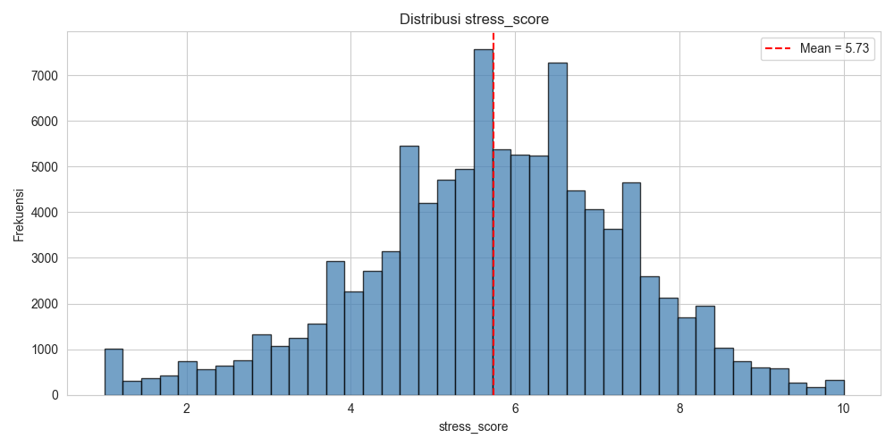

Distribusi target `stress_score` mendekati normal di sekitar **mean 5.73** (rentang 1.0–10.0) — tidak ada konsentrasi ekstrem di satu nilai.

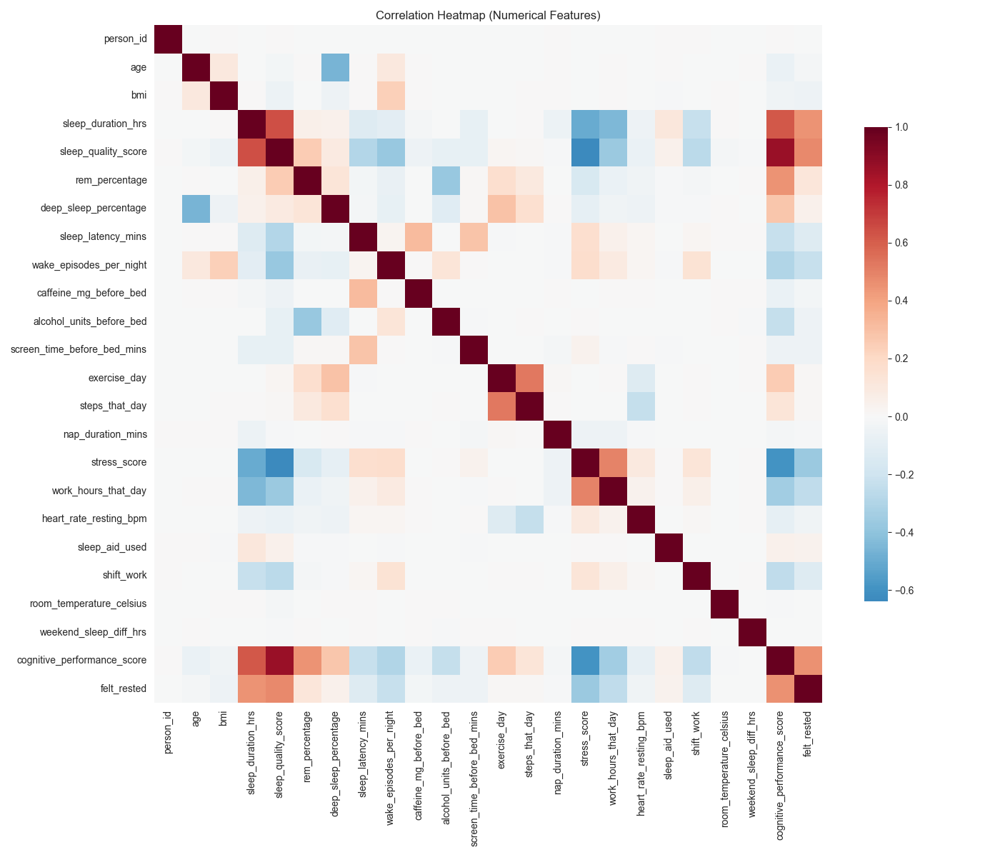

Korelasi antar fitur numerik. `stress_score` berkorelasi **negatif** paling kuat dengan `sleep_quality_score` (**r ≈ −0.64**) & `sleep_duration_hrs`, dan **positif** dengan `work_hours_that_day`.

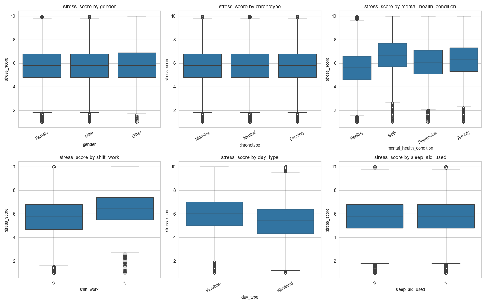

Stres per fitur kategorikal: **mental_health_condition** (Both/Anxiety/Depression > Healthy) dan **shift_work = 1** menaikkan stres; **Weekday > Weekend**; gender, chronotype, & sleep_aid relatif datar.

### PREDICT — Performa Model (Section 4–7)

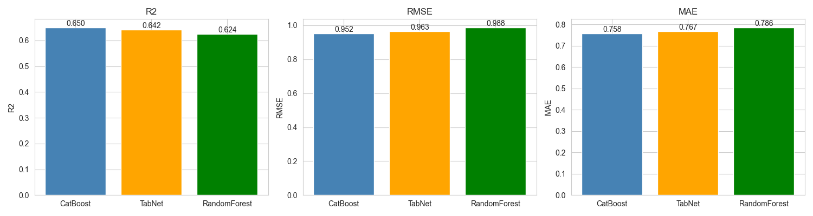

CatBoost unggul di ketiga metrik: **R² 0.650** · RMSE 0.952 · MAE 0.758, disusul TabNet (R² 0.642) dan Random Forest (R² 0.624). Gap tipis → gradient boosting & deep tabular sama-sama layak; CatBoost dipilih (plus dukungan kategorikal native).

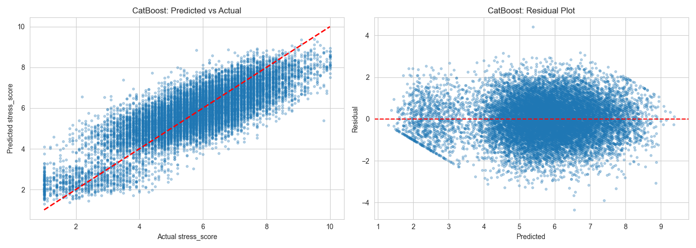

Kiri: prediksi vs aktual mengikuti garis diagonal; kanan: residual terpusat di ~0 tanpa pola — fit sehat, tanpa bias sistematis.

### EXPLAIN — SHAP (Section 8)

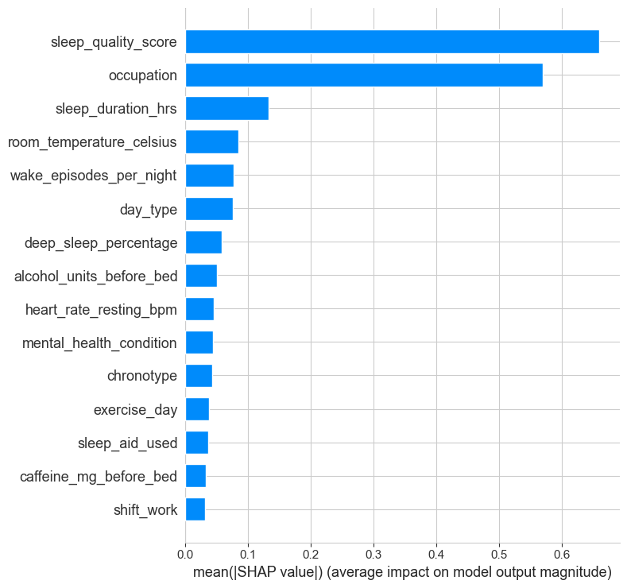

Importance global (mean |SHAP|): **`sleep_quality_score` (0.66)** & **`occupation` (0.57)** dominan, lalu `sleep_duration_hrs` (0.13), `room_temperature_celsius` (0.08), `wake_episodes_per_night` (0.08).

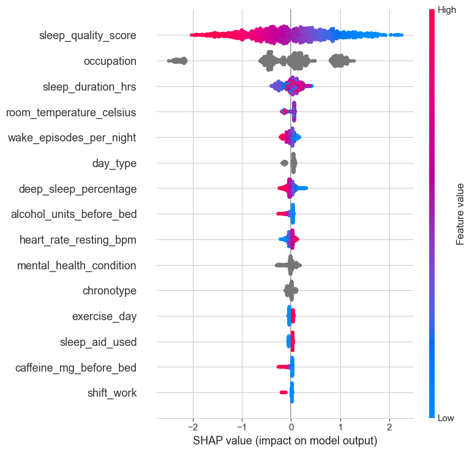

Arah pengaruh: nilai `sleep_quality_score` **tinggi (merah)** → SHAP **negatif** (menurunkan prediksi stres). Domain sign-check mengonfirmasi korelasi nilai-vs-SHAP **−0.996** untuk fitur teratas.

Penjelasan **lokal** (waterfall) untuk 3 individu studi kasus:

| Low stress | Mid stress | High stress |
|:---:|:---:|:---:|
| 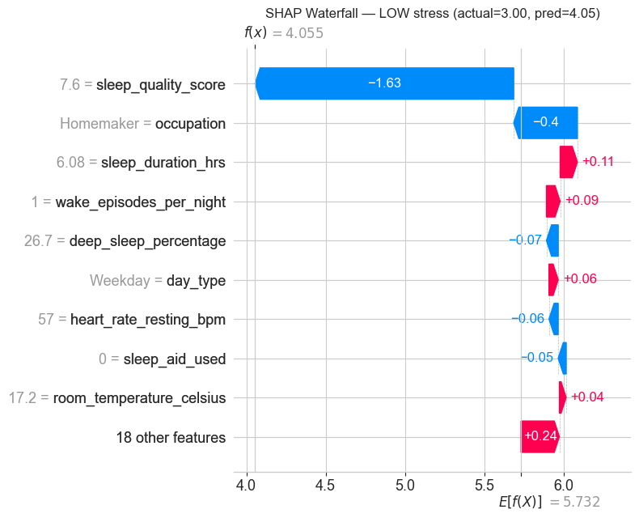 | 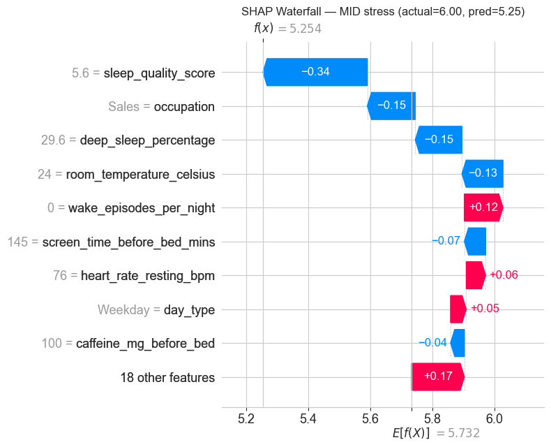 | 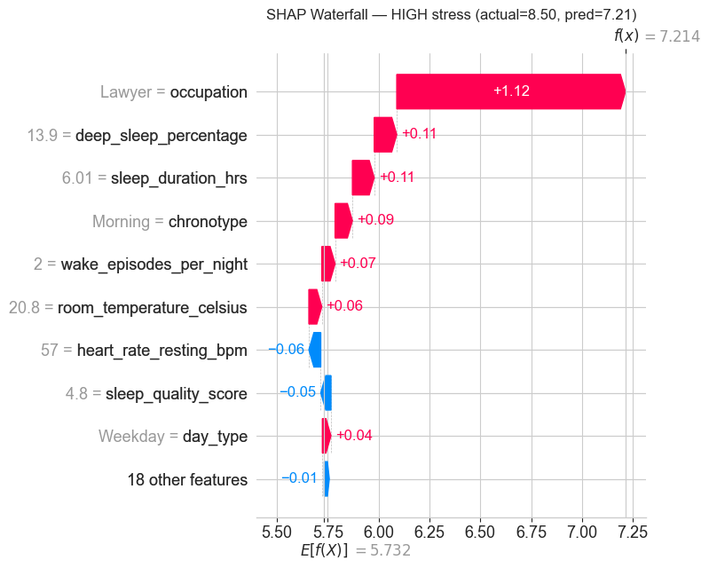 |

### PRESCRIBE — Counterfactual (Section 9)

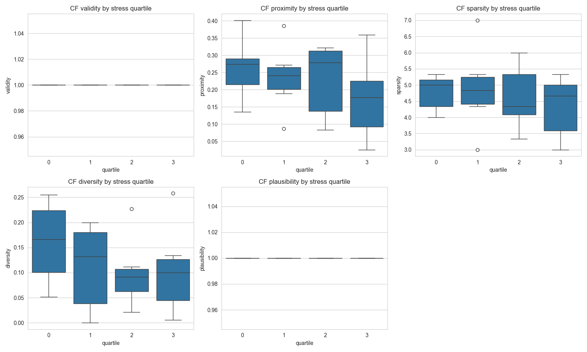

Distribusi 5 metrik counterfactual per kuartil stres: **Validity & Plausibility = 100%**, Proximity rendah (mean 0.226), Sparsity ~4.65 fitur berubah, Diversity ~0.12 — seimbang di semua kuartil (tidak bias ke level stres tertentu). Success rate keseluruhan **62.5% (25/40)**.

Tiga studi kasus (perubahan **behavior-only**, dari [`cf_case_studies.json`](outputs/reports/cf_case_studies.json)):

| Kasus | Aktual | Pred. | CF Pred. | Δ | Contoh perubahan |
|---|---|---|---|---|---|
| Low  | 3.0 | 4.05 | 3.89 | **−0.16** | tidur 6.08→4.0 jam, suhu 17.2→16°C |
| Mid  | 6.0 | 5.25 | 4.94 | **−0.32** | screen-time 145→111 mnt, sleep-aid 1→0 |
| High | 8.5 | 7.21 | 6.86 | **−0.35** | alkohol 1→0, tidur 6.0→8.4 jam |

### Ablation — Bukti Causal Restriction (Section 9)

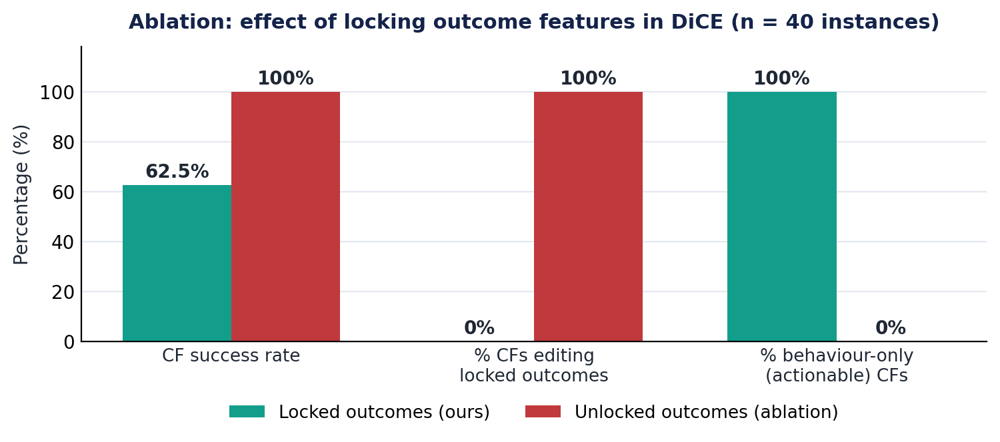

Membuka kunci fitur outcome menaikkan success **62.5% → 100%**, **TAPI** 100% counterfactual lalu mengubah outcome (mis. *"naikkan sleep_quality 4→8"* yang tak bisa user lakukan langsung) dan **0% murni actionable**. Setup kami (**locked**) menukar 37.5 poin success demi **100% rekomendasi behavior-only yang benar-benar bisa dijalankan** — inilah yang membuat pipeline ini *prescriptive*, bukan sekadar deskriptif.

## Setup

### 1. Buat virtual environment & install dependencies

PowerShell (Windows):

```powershell
python -m venv .venv
.\.venv\Scripts\Activate.ps1
pip install -r requirements.txt
```

Bash (Linux/Mac):

```bash
python -m venv .venv
source .venv/bin/activate
pip install -r requirements.txt
```

### 2. Siapkan API key OpenAI

```powershell
Copy-Item .env.example .env
# lalu edit .env, isi OPENAI_API_KEY
```

### 3. Jalankan notebook

```powershell
jupyter notebook stress_prediction.ipynb
```

Toggle `USE_SAMPLE = True` di Section 0 untuk iterasi cepat dengan 10k sampel (~15–20 menit). Set `False` di Section 13 untuk full 100k run (~60–120 menit, CPU only).

## Struktur Repository

```
.
├── stress_prediction.ipynb           # notebook utama end-to-end (13 sections)
├── sleep_health_dataset.csv          # dataset Kaggle 100k baris × 32 kolom
├── requirements.txt                  # dependencies Python
├── README.md                         # file ini
├── .env.example                      # template API key
├── docs/                             # dokumentasi
│   ├── research_draft.md             # draft riset & metodologi
│   ├── plan.md                       # detail implementasi per-section
│   ├── REFERENCES.md                 # 40 referensi IEEE (clickable)
│   └── PIPELINE_FLOWCHART.md         # penjelasan flowchart pipeline
├── prompts/
│   └── expert_system_prompt.md       # system prompt GPT dengan safety rules
├── data/processed/                   # encoder, scaler, split data (artifacts)
├── models/                           # model terlatih (catboost.cbm dll)
├── outputs/
│   ├── figures/                      # plot EDA, SHAP, CF (PNG)
│   ├── reports/                      # CSV/MD metrics & insights
│   ├── recommendations/              # output JSON naratif GPT per individu
│   └── pipeline_flowchart.svg/.png   # diagram flowchart pipeline
└── catboost_info/                    # log training CatBoost (auto-generated)
```

## Alur Kerja Notebook (13 Sections)

1. **Section 0–2**: Setup, load data, EDA (verifikasi statistik draft)
2. **Section 3**: Preprocessing (drop 4 leakage features, dual-encoding A/B, stratified 70/15/15)
3. **Section 4**: Train **CatBoost** ⭐ milestone (R² ≥ 0.6, MAE ≤ 1.0)
4. **Section 5–6**: Train Random Forest & TabNet
5. **Section 7**: Comparison + 5-Fold CV pada best model
6. **Section 8**: SHAP global (bar + beeswarm) + local (waterfall × 3) + domain validity sign-check
7. **Section 9**: Counterfactual analysis (DiCE genetic method)
    - Causal restriction: behavior vs outcome vs immutable
    - `permitted_range` safety constraints (alcohol locked at [0,0], dll)
    - 5 metrics: Validity, Proximity, Sparsity, Diversity, Plausibility
    - Cascade retry untuk case studies (target orig−0.30 → −0.15 → −0.05)
8. **Section 10**: GenAI naturalization dengan **3-layer validation**:
    - **Layer 1 — Safety filter**: regex blocklist (obat, diagnosa, promote alkohol)
    - **Layer 2 — Faithfulness check**: angka before/after exact match, no locked outcome leak
    - **Layer 3 — Structural validation**: required keys + type + content + nested schema
    - Iterative refinement retry (kirim feedback ke GPT antar attempt)
9. **Section 11**: Individual insights & kesimpulan (markdown rendering)
10. **Section 12**: Limitations & threats to validity (7 sub-sections)
11. **Section 13**: Instruksi re-run full 100k

## Causal Restriction (Yang Membuat Pipeline Unik)

DiCE counterfactual **hanya boleh mengubah** behavior features:
- `sleep_duration_hrs`, `screen_time_before_bed_mins`, `caffeine_mg_before_bed`
- `alcohol_units_before_bed`, `exercise_day`, `steps_that_day`
- `nap_duration_mins`, `room_temperature_celsius`, `sleep_aid_used`

Sementara outcome features (`sleep_quality_score`, `rem_percentage`, `heart_rate_resting_bpm`, dll) dan immutable features (`age`, `gender`, `occupation`, dll) **di-lock** dari modifikasi. Ini menjamin rekomendasi intervensi adalah **manipulable causes**, bukan outcomes yang user tidak bisa kontrol langsung.

## Lisensi & Akademik

Penelitian akademik, kode untuk reproducibility paper. Dataset Sleep Health & Daily Performance dari Kaggle (sintetis). Atribusi pada paper.
